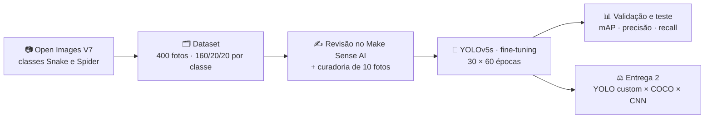
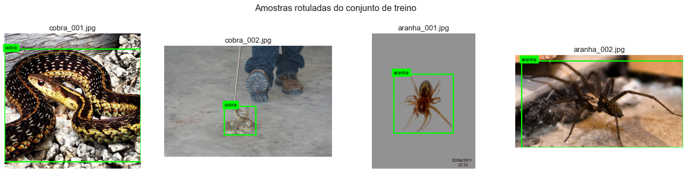
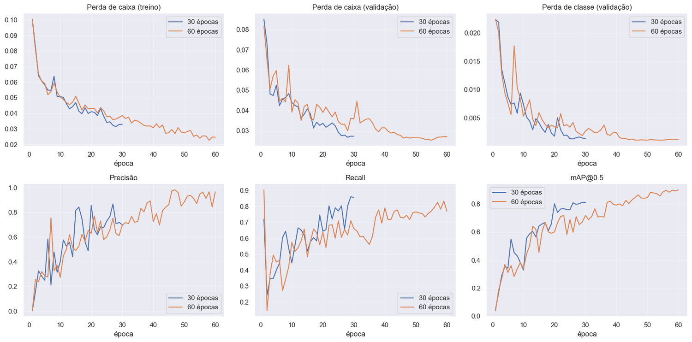
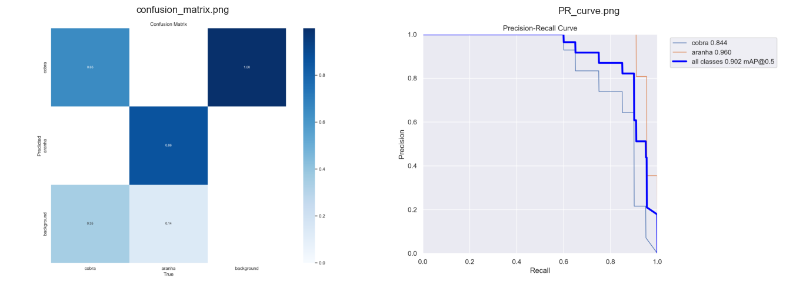
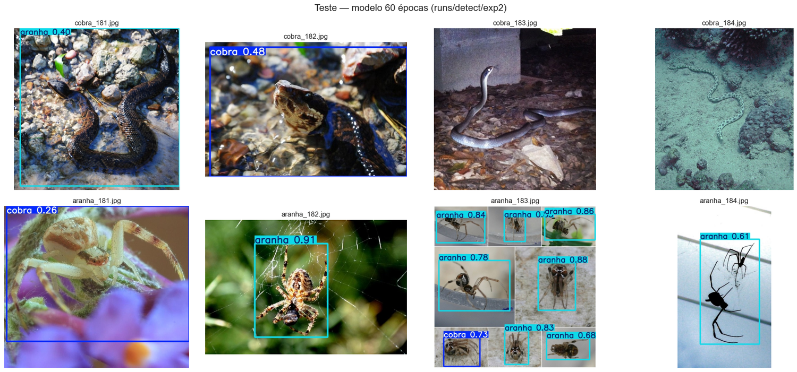
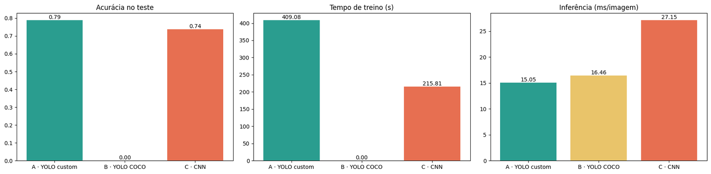
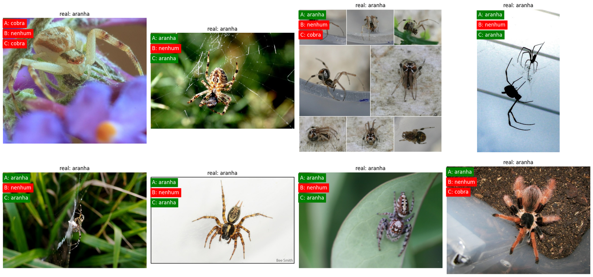
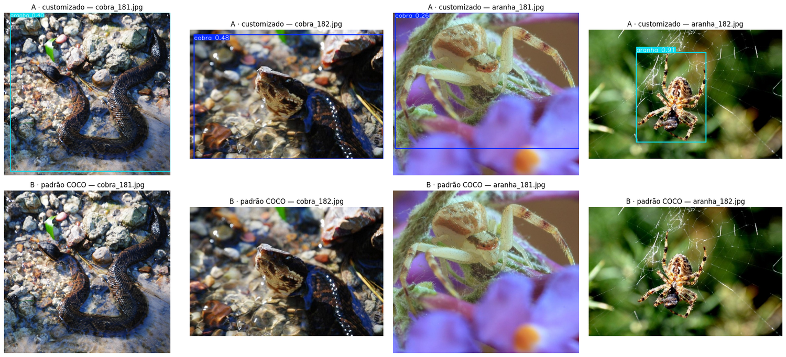

<div align="center">


# FIAP - Faculdade de Informática e Administração Paulista

> **Fase 6 · Visão Computacional com YOLO** — detecção de animais peçonhentos (cobras e aranhas) para a segurança de trabalhadores rurais.
>
> 
> 
> 
> 
> 
> 
> 
>
> </div>

---

<p align="center">
  <a href="https://www.fiap.com.br/">
    
  </a>
</p>

## 👨‍🎓 Integrantes

| RM | Nome | LinkedIn |
|---|---|---|
| RM573528 | Abimael Gomes Silva De Carvalho | [LinkedIn](https://www.linkedin.com/in/abimaelgomez/) |
| RM569623 | Élton de Oliveira Longaray | [LinkedIn](https://www.linkedin.com/in/eltonlongaray/) |
| RM572243 | Natália Gimenez Leite | [LinkedIn](https://www.linkedin.com/in/natalia-gimenez-leite/) |

## 👩‍🏫 Professores

#### Tutor(a)
- Sabrina Otoni

#### Coordenador(a)
- André Godoi

## 📜 Descrição

A **FarmTech Solutions** apresenta a um cliente do agronegócio um sistema de visão computacional capaz de reconhecer **cobras** e **aranhas** em imagens de câmeras instaladas em galpões, currais e áreas de colheita, para disparar alertas **antes** de um acidente.

O projeto treina um detector **YOLOv5** com um dataset próprio de **390 imagens**, rotulado com **revisão manual no Make Sense AI**, compara duas durações de treinamento (**30 × 60 épocas**) e confronta o modelo com outras duas abordagens: o **YOLOv5 padrão (COCO)** e uma **CNN treinada do zero**.

> Toda a metodologia, o código executado e a análise crítica estão nos notebooks. Este README apresenta o projeto, mostra os principais resultados e guia o leitor até eles.

## 🎥 Vídeo demonstrativo

▶️ [Assista no YouTube (não listado)](LINK_DO_VIDEO)

## 📓 Notebooks

| Entrega | Tema | Notebook | Abrir no Colab |
|---|---|---|---|
| **1** | Dataset, rotulação, treino com 30 e 60 épocas, validação, teste e conclusões | [`AbimaelGomes_rm573528_pbl_fase6.ipynb`](AbimaelGomes_rm573528_pbl_fase6.ipynb) | [](https://colab.research.google.com/github/abimaelgomez/fiap-fase6-visao-computacional/blob/main/AbimaelGomes_rm573528_pbl_fase6.ipynb) |
| **2** | YOLOv5 customizado × YOLOv5 padrão × CNN do zero: precisão, facilidade de uso, tempo de treino e de inferência | [`AbimaelGomes_rm573528_pbl_fase6_entrega2.ipynb`](AbimaelGomes_rm573528_pbl_fase6_entrega2.ipynb) | [](https://colab.research.google.com/github/abimaelgomez/fiap-fase6-visao-computacional/blob/main/AbimaelGomes_rm573528_pbl_fase6_entrega2.ipynb) |

## 🧭 Visão geral do projeto



## 🗂️ Dataset e rotulação

| | Cobra | Aranha | Total |
|---|---:|---:|---:|
| Treino | 153 | 159 | **312** |
| Validação | 20 | 20 | **40** |
| Teste | 19 | 19 | **38** |
| **Total** | **192** | **198** | **390** |

- **Fonte:** [Open Images V7](https://storage.googleapis.com/openimages/web/index.html) (fotos reais, com caixas desenhadas por humanos). Filtros: sem desenhos nem caixas de grupo, objeto ocupando ao menos 2 % da imagem.
- **Divisão:** 80 % treino · 10 % validação · 10 % teste, com semente fixa (mesma proporção do enunciado, com bem mais que as 40 imagens mínimas por classe).
- **Revisão no Make Sense AI:** o integrante **Élton de Oliveira Longaray** conferiu as **320 imagens de treino** uma a uma. Manteve 303 rótulos, **removeu 5 caixas duplicadas, ajustou 4** e apontou **8 imagens inadequadas** (lagartixas, escultura de museu, brinquedo, imagem artificial, emaranhado de cobras e cobra escondida). O conjunto de teste foi inspecionado pelos mesmos critérios, e 2 imagens foram removidas (um ácaro e uma cobra quase invisível). O resultado exportado em formato YOLO está em [`makesense/exportado_yolo.zip`](makesense/exportado_yolo.zip) e é aplicado automaticamente pelo notebook.

<p align="center">
  
  <br/><sub>Amostras do conjunto de treino com as caixas já revisadas.</sub>
</p>

## 📊 Entrega 1 · YOLOv5 customizado (30 × 60 épocas)

O YOLOv5s parte dos pesos pré-treinados no COCO (*transfer learning*) e é ajustado às duas classes. Só o número de épocas muda entre as simulações. Resultado no **conjunto de teste (38 imagens)**:

| Indicador | 30 épocas | 60 épocas |
|---|---:|---:|
| Precisão | 0,662 | **0,744** |
| Recall | 0,619 | **0,783** |
| mAP@0.5 | 0,651 | **0,780** |
| mAP@0.5:0.95 | 0,397 | **0,506** |
| Tempo de treino (T4) | 3,8 min | 6,8 min |

**60 épocas** foi o modelo recomendado: o treino leva 1,8× mais tempo, mas o ganho de mAP compensa e a perda de validação não mostra *overfitting* relevante.

<p align="center">
  
  <br/><sub>Curvas de aprendizado: perdas (treino e validação), precisão, recall e mAP@0.5 por época.</sub>
</p>

<p align="center">
  
  <br/><sub>Matriz de confusão e curva precisão × recall na validação (60 épocas).</sub>
</p>

<p align="center">
  
  <br/><sub>Imagens de teste processadas pelo modelo de 60 épocas. Há acertos e também erros (cobra 181 classificada como aranha), exibidos sem filtro.</sub>
</p>

> ⚠️ **Variação entre execuções.** GPU e *data augmentation* tornam o treino levemente não determinístico: em outras execuções do mesmo notebook o mAP@0.5 de 60 épocas variou entre 0,78 e 0,86. Com 38 imagens de teste, cada erro vale cerca de 2,6 pontos de acurácia. Os valores acima são os da execução publicada no notebook.

## 🔬 Entrega 2 · Comparação de três abordagens

As três abordagens são avaliadas como **classificadores de imagem** no mesmo conjunto de teste (para os YOLO, vale a classe da detecção de maior confiança):

| Abordagem | Acurácia | F1 macro | Treino | Inferência | Parâmetros |
|---|---:|---:|---:|---:|---:|
| **A · YOLOv5s customizado** (Entrega 1, 60 ép.) | **78,9 %** | **0,853** | 6,8 min | 15,1 ms/img | 7,0 M |
| B · YOLOv5s padrão (COCO) | 0 % | 0,000 | nenhum | 16,5 ms/img | 7,2 M |
| **C · CNN do zero** (Keras) | 73,7 % | 0,737 | 3,6 min | 27,2 ms/img | 0,4 M |

- **A** é a mais precisa e a única que também **localiza** e conta os animais. Em 6 das 38 imagens ela não detectou nada, e isso conta como erro.
- **B** zera porque **cobra e aranha não existem no vocabulário do COCO**: um modelo genérico não resolve uma classe que nunca viu.
- **C** aprende com apenas 312 imagens e chega perto da A na triagem "há cobra ou aranha nesta foto?", mas não localiza nada e generaliza pior para cenários novos.
- Neste Colab a CNN **não** foi a mais rápida na inferência, apesar de ter 18× menos parâmetros: o tempo inclui carregar o JPEG e chamar o Keras imagem a imagem.

<p align="center">
  
  <br/><sub>Acurácia no teste, tempo de treino e tempo de inferência das três abordagens.</sub>
</p>

<p align="center">
  
  <br/><sub>Previsão de cada abordagem por imagem de teste (verde = acerto, vermelho = erro).</sub>
</p>

<p align="center">
  
  <br/><sub>YOLO customizado (acima) × YOLO padrão COCO (abaixo) nas mesmas imagens.</sub>
</p>

### Recomendação à FarmTech

| Necessidade do cliente | Abordagem |
|---|---|
| Localizar e contar animais peçonhentos, alertas por região da imagem | **A · YOLO customizado** |
| Prova de conceito com objetos que já estão no COCO (pessoas, veículos, gado) | **B · YOLO padrão** |
| Triagem barata "há cobra ou aranha?" em hardware limitado | **C · CNN** (idealmente com *transfer learning*) |

## ▶️ Como executar

1. Abra o notebook da **Entrega 1** pelo botão do Colab e selecione **Ambiente de execução → Alterar tipo → GPU (T4)**.
2. Execute todas as células (**Ambiente de execução → Executar tudo**) e autorize o acesso ao Google Drive, onde ficam dataset, pesos e resultados (`MyDrive/FarmTech_Fase6`; é preciso ter ao menos 500 MB livres). O tempo total é de cerca de 20 minutos.
3. Execute o notebook da **Entrega 2**, que reutiliza o dataset e o melhor modelo salvos no Drive pela Entrega 1 (cerca de 10 minutos).

Os rótulos revisados e a verificação de integridade das imagens vêm deste repositório, sem passo manual.

## 📁 Estrutura do repositório

```
fiap-fase6-visao-computacional/
├── AbimaelGomes_rm573528_pbl_fase6.ipynb            ← Entrega 1: YOLOv5 customizado (30 × 60 épocas)
├── AbimaelGomes_rm573528_pbl_fase6_entrega2.ipynb   ← Entrega 2: comparação de três abordagens
├── makesense/
│   ├── exportado_yolo.zip                           ← rótulos revisados no Make Sense (formato YOLO)
│   └── assinaturas_treino.json                      ← verificação de que as imagens são as revisadas
├── assets/                                          ← figuras usadas neste README (extraídas dos notebooks)
└── README.md
```

## 🛠️ Tecnologias


YOLOv5 (Ultralytics) · TensorFlow/Keras · Make Sense AI · Open Images V7 · Google Drive

## 📋 Licença

[MODELO GIT FIAP](https://github.com/agodoi/template) por [FIAP](https://fiap.com.br) está licenciado sobre [Attribution 4.0 International](http://creativecommons.org/licenses/by/4.0/?ref=chooser-v1).

© 2026 Grupo FarmTech Solutions · FIAP — Inteligência Artificial
